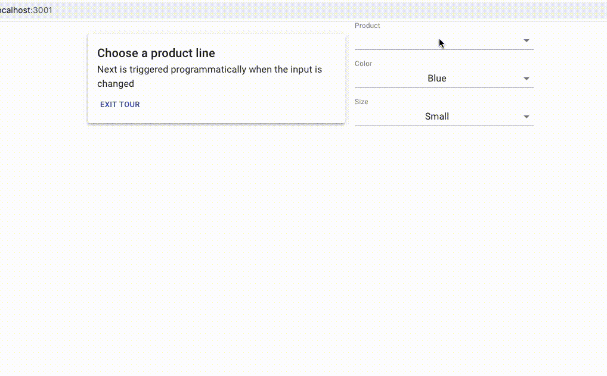

# React Guided Tour

This is an example of how you can design your own Guided Tour functionality in
React. In this example we're using [Material-UI](https://material-ui.com/) for
styling components, but you could swap it with whatever you like to use.

## Usage
```jsx
// Wrap your elements that need hints
<form>
    <CustomTourStop>
    // ... element (e.g. form input or section)
    </CustomTourStop>
    <CustomTourStop2>
    // ... element (e.g. form input or section)
    </CustomTourStop2>
</form>

// this tour stop will transition to CustomTourStop2
// when "next" is pressed
function CustomTourStop(props: {children: ...}) {
    return (
        <GuidedTourStop 
            title="This input is awesome" 
            description="make sure you check everything carefully" 
            next={CustomTourStop2}>
            {props.children}
        </GuidedTourStop>
    )
}

// this tour stop is the last one
function CustomTourStop2(props: {children: ...}) {
    return (
        <GuidedTourStop 
            title="This input is awesome too!" 
            description="da. da. da">
            {props.children}
        </GuidedTourStop>
    )
}

// transition between tour stops programmatically (for non-linear flows)
function CustomElement() {
    const tour = useGuidedTour();
    const onChange = useCallback((value) => {
        setValue(value);
        tour.moveTo(CustomTourStop2);
    }, [tour]);

    return <input onChange={onChange}>
}

// Link up the provider
<GuidedTourProvider>
   // ... app content
</GuidedTourProvider>
```

# Demo

```
git clone https://github.com/ntbosscher/react-guided-tour.git
cd react-guided-tour
yarn start
```



## Available Scripts

In the project directory, you can run:

### `yarn start`

Runs the app in the development mode.<br />
Open [http://localhost:3000](http://localhost:3000) to view it in the browser.

The page will reload if you make edits.<br />
You will also see any lint errors in the console.

### `yarn build`

Builds the app for production to the `build` folder.<br />
It correctly bundles React in production mode and optimizes the build for the best performance.

The build is minified and the filenames include the hashes.<br />
Your app is ready to be deployed!

See the section about [deployment](https://facebook.github.io/create-react-app/docs/deployment) for more information.
